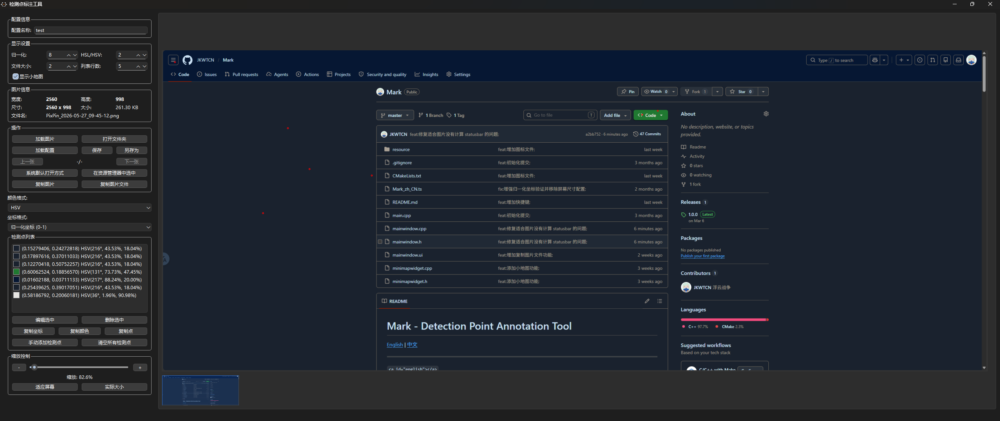

# Mark - 检测点标注工具

Mark 是一个基于 **Qt 6 / C++17** 构建的轻量级检测点标注工具。你可以在图片上点击添加检测点，并以多种格式导出坐标和颜色。适用于计算机视觉工作流、标定数据采集和颜色取样。



## 功能特性

- **点标注**：在图片上点击添加检测点
- **双坐标系统**：支持像素坐标与归一化坐标 (0.0-1.0)
- **多种颜色格式**：支持 RGB、HEX、HSL、HSV、CMYK
- **文件夹浏览**：使用方向键在图片序列间导航
- **缩放**：平滑缩放最高达 3200%，高倍缩放下保持像素级渲染
- **小地图**：通过概览导航组件快速定位图片区域
- **搜索检测点**：按序号、坐标或颜色过滤检测点并自动定位
- **拖拽打开**：直接拖拽图片到窗口中打开
- **JSON 导入/导出**：保存和加载带完整元数据的配置文件
- **复制粘贴**：复制坐标、颜色或图片文件到剪贴板
- **资源管理器集成**：在资源管理器中打开或选中文件
- **可调精度**：自定义坐标和颜色值的小数位数
- **键盘快捷键**：常用操作支持键盘快捷键

## 键盘快捷键

| 快捷键           | 操作            |
| ---------------- | --------------- |
| `Ctrl+O`       | 打开图片        |
| `Ctrl+Shift+O` | 打开文件夹      |
| `Ctrl+F`       | 搜索检测点      |
| `Ctrl+L`       | 加载配置        |
| `Ctrl+S`       | 保存配置        |
| `Ctrl+Shift+S` | 另存为          |
| `←`           | 上一张图片      |
| `→`           | 下一张图片      |
| `Ctrl+=`       | 放大            |
| `Ctrl+-`       | 缩小            |
| `Ctrl+0`       | 适应屏幕        |
| `Ctrl+1`       | 实际大小 (100%) |
| `Delete`       | 删除选中检测点  |

## 构建

前置条件：

- CMake >= 3.16
- Qt 6
- C++17 编译器

```bash
mkdir build && cd build
cmake ..
cmake --build .
```

可执行文件生成在 `bin/` 目录中。

## 坐标系统

### 归一化坐标公式

Mark 使用 **(宽度 - 1)** 和 **(高度 - 1)** 作为分母，并限制下界为 1 以避免除零：

```text
归一化X = 像素X / max(1, 图片宽度 - 1)
归一化Y = 像素Y / max(1, 图片高度 - 1)
```

该公式在界面显示、JSON 导出 (`toJson`) 和 JSON 导入 (`fromJson`) 中保持一致。

示例：在 1920x1080 的图片上，右下角像素 (1919, 1079) 会映射到恰好 (1.0, 1.0)。中心像素 (960, 540) 会映射到 (0.500261, 0.500466)。

### 从归一化坐标还原像素坐标

```text
像素X = round(归一化X * max(1, 图片宽度 - 1))
像素Y = round(归一化Y * max(1, 图片高度 - 1))
```

注意事项：

1. 分母是 `width - 1` / `height - 1`，最小为 1，不是 `width` / `height`。第一个像素 (0, 0) 映射到 0.0，最后一个像素映射到恰好 1.0。
2. 使用 `qRound()` 四舍五入，与 Mark 内部实现一致。
3. 导入时归一化值会被限制在 [0.0, 1.0] 范围内。
4. `imageWidth` 和 `imageHeight` 始终保存在 JSON 中，因此总能还原像素位置。

### C++ 示例

```cpp
#include <algorithm>
#include <cmath>

// 将 Mark 的归一化坐标转换回像素坐标
void normalizedToPixel(double normX, double normY,
                       int imgWidth, int imgHeight,
                       int &outPixelX, int &outPixelY)
{
    outPixelX = qRound(normX * std::max(1, imgWidth - 1));
    outPixelY = qRound(normY * std::max(1, imgHeight - 1));
}

// 将像素坐标转换为 Mark 的归一化坐标
void pixelToNormalized(int pixelX, int pixelY,
                       int imgWidth, int imgHeight,
                       double &outNormX, double &outNormY)
{
    outNormX = static_cast<double>(pixelX) / std::max(1, imgWidth - 1);
    outNormY = static_cast<double>(pixelY) / std::max(1, imgHeight - 1);
}

int main()
{
    int imgWidth = 1920;
    int imgHeight = 1080;

    int px;
    int py;
    normalizedToPixel(0.5, 0.5, imgWidth, imgHeight, px, py);
    // px = 960, py = 540

    double nx;
    double ny;
    pixelToNormalized(960, 540, imgWidth, imgHeight, nx, ny);
    // nx = 0.500261..., ny = 0.500466...

    return 0;
}
```

## JSON 配置格式

```json
{
    "xyFormat": "normalized",
    "colorFormat": "rgb",
    "imageWidth": 1920,
    "imageHeight": 1080,
    "normalizedDecimals": 6,
    "colorDecimals": 0,
    "configName": "my_annotation",
    "pointsListVisibleRows": 5,
    "points": [
        [0.500261, 0.500466, 255, 128, 0],
        [0.250130, 0.750233, 0, 200, 100]
    ]
}
```

不同格式下的点数组结构：

| xyFormat       | colorFormat | 数组布局                           |
| -------------- | ----------- | ---------------------------------- |
| `pixel`      | `rgb`     | `[x, y, r, g, b]`                |
| `normalized` | `rgb`     | `[normX, normY, r, g, b]`        |
| `pixel`      | `hex`     | `[x, y, "#rrggbb"]`              |
| `normalized` | `hsv`     | `[normX, normY, h_度, s_%, v_%]` |
| `normalized` | `hsl`     | `[normX, normY, h_度, s_%, l_%]` |
| `normalized` | `cmyk`    | `[normX, normY, c, m, y, k]`     |

HSV/HSL 值中色相为度数 (0 <= H < 360)，饱和度/明度/亮度为百分比 (0-100)。当 `colorDecimals` 大于 0 时，H/S/V/L 都会按该精度保留小数。CMYK 值为整数，范围与 Qt 返回值一致，为 0-255。
